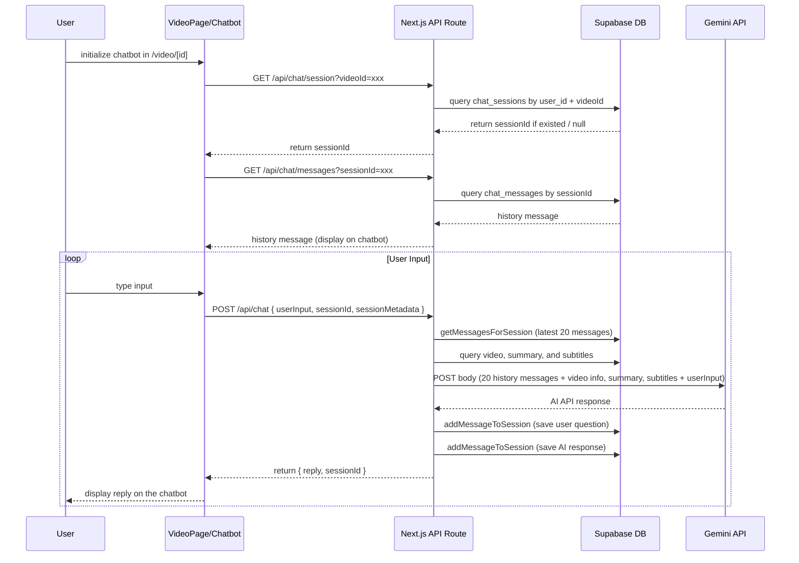

這篇文章紀錄的是，我如何在 videoSummarizer 的每支影片頁面下方，加入一個能記憶上下文、根據影片內容回答問題的聊天機器人，讓我能像用 ChatGPT 一樣做主題式的討論。

這顆聊天機器人具備：

- 能夠記憶對話歷史，理解上下文
- 能讀取影片的完整內容、摘要與字幕，並結合回答
- 支援跨裝置同步，無論在哪台裝置，只要登入後(非訪客)都可以看到對話紀錄並延續討論

[Demo Video]

---

## 核心需求

一般的聊天機器人往往只有單次對話，並且能理解的資訊有限且固定，不像LLM模型有大型context能夠儲存並極大程度地理解使用者問題

---

## 功能設計

從需求出發，大概規畫最終需要實現的功能：

- 通過懸浮按鈕 (FAB) 個別影片詳情頁觸發。
- 能自動識別所在的影片頁，從資料庫檢索影片標題、完整字幕、摘要。
- 將上述資訊作為上下文，連同對話歷史和使用者問題，發送給 LLM，讓LLM基於完整的上下文回答問題。
- 對話歷史被儲存，支持連貫的多輪對話。
- 可在非訪客模式下同步歷史紀錄，以不同裝置登入時接續對話。

---

## 元件架構

此 AI 聊天機器人主要由以下幾個層次和組件構成：

- **前端**：

  - **`Chatbot` UI 元件 (`app/components/chat/chatbot.tsx`)**:
    - 渲染聊天視窗、顯示訊息列表、處理使用者輸入。
    - 管理本地 UI 狀態 (輸入框內容、加載狀態、錯誤訊息)。
    - 接收 `contextMetadata` (如 `videoId`) 來了解當前聊天上下文。
    - 通過 `/api/chat` 與route通訊。
  - **懸浮操作按鈕 (FAB)**:
    - 放置在影片詳情頁的右下角。
    - 使用者點擊 FAB 來觸發展示或隱藏 `Chatbot` UI 元件。

- \*\*後端 ：
  - **API Route (`app/api/chat/route.ts`)**:
    - 接收來自前端 `Chatbot` UI 的 POST 請求。
    - 解析請求體中的參數 (使用者輸入 `userInput`、會話 ID `sessionId`、上下文元數據 `sessionMetadata`)，並透過`getServerSession`去取得 userId
    - 調用 Agent 服務層的核心處理函式 `processUserMessage`
- \*\*Agent 服務層：

  - **`lib/agent/agent.ts` (核心函式: `processUserMessage`)**: 執行核心的聊天和上下文處理邏輯。
    - **會話管理**: 調用 `memory.ts` 中的函式來獲取現有聊天會話或創建新會話。
    - **訊息持久化**: 將使用者的提問和 AI 的回答儲存到資料庫（通過 `memory.ts`）。
    - **對話歷史檢索**: 從資料庫加載最近的對話歷史，以提供多輪對話的上下文。
    - **影片上下文獲取**: 從DB中取得影片標題、摘要、與完整字幕
    - \*\*上下文構建: 將獲取到的影片標題、摘要（如果存在）、完整字幕文本（如果存在）以及對話歷史，加上提示Prompt給到LLM
  - **`lib/agent/memory.ts`**: 負責數據的持久化存儲和檢索。

    - 數據儲存封裝了所有與 Supabase 資料庫的直接交互邏輯，並提供函式接口 供 `agent.ts`調用。

  - **Supabase資料庫**:
    - **`chat_sessions` 表**: 儲存每個聊天會話的元數據，如 `id`, `user_id`, `created_at`, `updated_at`, 以及與會話相關的 `metadata`。
    - **`chat_messages` 表**: 儲存聊天會話中的每一條訊息，包括 `id`, `session_id`, `role`, `content`, `created_at`。



---

## 實作步驟

### 步驟 1：資料庫準備 (Supabase Setup)

為了儲存聊天會話和訊息，我們需要在 Supabase 資料庫中創建兩個新的資料表：`chat_sessions` 和 `chat_messages`。同時，我們也依賴現有的 `videos` 和 `summaries` 表來獲取影片上下文。

**SQL DDL (Data Definition Language)：**

請在你的 Supabase 專案的 SQL Editor 中執行以下指令來創建所需的資料表和輔助函式：

```sql
-- 創建 chat_sessions 資料表
-- 用於儲存每個獨立的聊天會話的基本資訊。
CREATE TABLE public.chat_sessions (
  id UUID PRIMARY KEY DEFAULT gen_random_uuid(), -- 會話的唯一標識符
  user_id UUID REFERENCES auth.users(id) ON DELETE SET NULL, -- (可選) 關聯到 Supabase Auth 的使用者 ID
  created_at TIMESTAMPTZ NOT NULL DEFAULT now(), -- 會話創建時間
  updated_at TIMESTAMPTZ NOT NULL DEFAULT now(), -- 會話最後更新時間 (例如，有新訊息時更新)
  metadata JSONB -- (可選) 用於儲存與會話相關的額外元數據，例如當前討論的 videoId
);

-- 創建 chat_messages 資料表
-- 用於儲存每個聊天會話中的所有訊息。
CREATE TABLE public.chat_messages (
  id UUID PRIMARY KEY DEFAULT gen_random_uuid(), -- 訊息的唯一標識符
  session_id UUID NOT NULL REFERENCES public.chat_sessions(id) ON DELETE CASCADE, -- 外鍵，關聯到 chat_sessions 表的 id。如果會話被刪除，其所有訊息也會被刪除。
  role TEXT NOT NULL, -- 訊息的角色，例如 'user', 'assistant', 'system', 'tool'
  content TEXT, -- 訊息的文本內容
  tool_calls JSONB, -- (未來擴展) 如果是 assistant 發出的工具調用請求
  tool_call_id TEXT, -- (未來擴展) 如果是 tool 的回應，對應的 tool_call ID
  name TEXT, -- (未來擴展) 如果是 tool 的回應，工具的名稱
  created_at TIMESTAMPTZ NOT NULL DEFAULT now(), -- 訊息創建時間
  metadata JSONB -- (可選) 用於儲存與訊息相關的額外元數據
);

-- 輔助函式：用於自動更新 chat_sessions 表的 updated_at 時間戳
CREATE OR REPLACE FUNCTION public.update_updated_at_column()
RETURNS TRIGGER AS $$
BEGIN
  NEW.updated_at = now(); -- 將 updated_at 欄位設為當前時間
  RETURN NEW; -- 返回修改後的記錄
END;
$$ LANGUAGE plpgsql;

-- 觸發器：在 chat_sessions 表的記錄被更新 (UPDATE) 之前，自動調用上述函式
CREATE TRIGGER update_chat_sessions_updated_at
BEFORE UPDATE ON public.chat_sessions
FOR EACH ROW
EXECUTE FUNCTION public.update_updated_at_column();
```

**欄位設計說明：**

- `chat_sessions.user_id`: 如果你的應用程式有使用者認證系統 (如此專案使用 NextAuth.js 和 Supabase Auth)，這個欄位可以將聊天會話與特定使用者關聯起來。`ON DELETE SET NULL` 表示如果 Supabase `auth.users` 表中的使用者被刪除，這裡對應的 `user_id` 會被設為 `NULL` (聊天記錄仍然保留，但不再關聯到該已刪除使用者)。你也可以根據需求改為 `ON DELETE CASCADE` (刪除使用者時一併刪除其所有聊天會話)。如果允許匿名聊天，此欄位應允許 `NULL`。
- `chat_sessions.metadata`: 一個 JSONB 欄位，非常靈活，可以用來儲存任何與會話相關的結構化數據。我們用它來儲存當前聊天上下文關聯的 `videoId`。
- `chat_messages.session_id`: 通過這個外鍵，我們可以輕易地查詢到某個特定會話下的所有訊息。`ON DELETE CASCADE` 確保了數據的完整性。
- `chat_messages.role`: 遵循了 OpenAI Chat Completions API 中訊息角色的常見約定 (`user`, `assistant`, `system`)，並為未來的工具使用預留了 `tool` 角色。
- `update_updated_at_column` 函式和觸發器：這是一個常見的 PostgreSQL 模式，用於在某一行被更新時自動維護 `updated_at` 時間戳，方便追蹤記錄的最新活動時間。

**Row Level Security (RLS) 注意事項：**

在 Supabase 中，強烈建議為所有包含敏感或使用者特定數據的資料表啟用 RLS，並定義合適的策略來控制數據的訪問權限。

對於 `chat_sessions` 和 `chat_messages` 表，你可能需要考慮以下 RLS 策略：

- **允許使用者創建自己的聊天會話和訊息。**
- **允許使用者讀取和更新他們 eigenen 聊天會話和訊息。**
- **不允許使用者讀取或修改其他使用者的聊天數據。**

我們在之前的調試過程中，為了確保 Agent 能夠讀取 `videos` 和 `summaries` 表，添加了允許公開讀取的 RLS 策略：

```sql
-- 為 videos 表啟用 RLS (如果尚未啟用)
-- ALTER TABLE public.videos ENABLE ROW LEVEL SECURITY;
-- CREATE POLICY "Allow public read access to videos"
--   ON public.videos FOR SELECT USING (true);

-- 為 summaries 表啟用 RLS (如果尚未啟用)
-- ALTER TABLE public.summaries ENABLE ROW LEVEL SECURITY;
-- CREATE POLICY "Allow public read access to summaries"
--   ON public.summaries FOR SELECT USING (true);
```

對於 `chat_sessions` 和 `chat_messages`，如果你的應用程式有使用者登入，那麼 RLS 策略通常會基於 `auth.uid() = user_id` 這樣的條件。如果允許匿名聊天，則需要更仔細地設計策略。

**在執行完上述 SQL DDL 後，你的資料庫就準備好儲存聊天數據了。**

### 步驟 2：記憶管理模組 (`lib/agent/memory.ts`)

這個 TypeScript 模組負責封裝所有與 Supabase 資料庫中聊天相關資料表的交互邏輯。它為 Agent 服務層提供了一組清晰、可重用的函式接口。

**核心功能：**

- 創建新的聊天會話 (`createChatSession`)。
- 向指定的會話中添加新的聊天訊息 (`addMessageToSession`)。
- 獲取指定會話的聊天歷史記錄 (`getMessagesForSession`)。
- 根據會話 ID 獲取會話詳情 (`getSessionById`，我們在 `agent.ts` 中實現為內部輔助函式，但也可以放在 `memory.ts`)。
- 更新會話的元數據 (`updateSessionMetadata`)。
- (可選) 獲取某個使用者的所有聊天會話 (`getSessionsForUser`)。

**主要函式實現概覽 (參考 `lib/agent/memory.ts` 的最終程式碼)：**

- **`createChatSession`**:

  - 接收 `supabase` client 實例、可選的 `userId` 和可選的 `initialMetadata`。
  - 向 `chat_sessions` 表插入一條新記錄，包含 `user_id` 和 `metadata`。
  - 使用 `.select().single()` 來獲取並返回新創建的會話對象。
  - 包含錯誤處理。

- **`addMessageToSession`**:

  - 接收 `supabase` client、`sessionId` 和訊息數據對象 (`role`, `content`, 等)。
  - 向 `chat_messages` 表插入一條新記錄，關聯到 `sessionId`。
  - 在成功插入訊息後，**自動更新**對應 `chat_sessions` 記錄的 `updated_at` 時間戳（通過我們之前創建的資料庫觸發器，或者也可以在程式碼中手動更新）。
  - 返回新創建的訊息對象。
  - 包含錯誤處理。

- **`getMessagesForSession`**:

  - 接收 `supabase` client、`sessionId`，以及可選的 `limit` 和 `offset` (用於分頁)。
  - 從 `chat_messages` 表查詢所有 `session_id` 匹配的記錄。
  - 通常按 `created_at` **降序**排列 (最新的訊息在前)，以便在 UI 中更容易處理。但傳給 OpenAI 時，我們通常需要**升序** (最舊的在前)，所以在 Agent 層會進行 `reverse()`。
  - 返回訊息列表。
  - 包含錯誤處理。

- **`updateSessionMetadata`**:
  - 接收 `supabase` client、`sessionId` 和新的 `metadata` 對象。
  - 更新 `chat_sessions` 表中對應記錄的 `metadata` 欄位 (同時也會觸發 `updated_at` 的更新)。
  - 返回更新後的會話對象。

**引入 Supabase Client：**
這些函式都依賴於一個已初始化的 `SupabaseClient` 實例。通常，你會在專案的某個共用位置 (例如 `lib/supabase.ts`) 初始化它，然後在 `memory.ts` 中導入：

```typescript
// lib/agent/memory.ts
import { SupabaseClient } from '@supabase/supabase-js';
import { supabase } from '../supabase'; // 假設 supabase client 從這裡導入
// ... 函式定義 ...
```

這個模組的良好封裝，使得 Agent 服務層的邏輯更清晰，並且如果將來需要更換數據庫或調整儲存細節，主要修改可以集中在 `memory.ts` 中。

### 步驟 3：核心 Agent 服務 (`lib/agent/agent.ts`)

這是我們 AI 聊天機器人的「大腦」，負責協調整個對話流程。我們將其實現為一個主要的 `processUserMessage` 異步函式。

**`processUserMessage` 函式簽名：**

```typescript
export async function processUserMessage(
  userInput: string,
  sessionId?: string,
  userId?: string,
  sessionMetadata?: Record<string, any>
): Promise<AgentResponse>;
```

它接收使用者輸入、可選的會話 ID、可選的使用者 ID 以及可選的會話元數據 (我們用它來傳遞 `videoId`)，並返回一個包含 AI 回覆和會話 ID 的 `AgentResponse` 對象。

**核心邏जिक流程詳解：**

1.  **會話處理 (Session Handling)**：

    - 如果請求中提供了 `sessionId`：
      - 調用 `getSessionById` (一個內部輔助函式，或從 `memory.ts` 導入) 來獲取現有會話。
      - 如果找不到會話，拋出錯誤。
      - 如果請求中也提供了新的 `sessionMetadata` (例如，使用者在聊天過程中切換了影片上下文)，則調用 `updateSessionMetadata` 更新會話的元數據。
    - 如果沒有提供 `sessionId`：
      - 調用 `createChatSession` (從 `memory.ts`) 創建一個新的聊天會話，並傳入 `userId` (如果可用) 和 `sessionMetadata`。
    - 此步驟確保我們總是有一個 `currentSession` 對象來進行後續操作。

2.  **儲存使用者訊息 (Persist User Message)**：

    - 調用 `addMessageToSession` (從 `memory.ts`)，將當前使用者的 `userInput` 和 `role: 'user'` 儲存到 `chat_messages` 表，關聯到 `currentSession.id`。

3.  **獲取對話歷史 (Retrieve Conversation History)**：

    - 調用 `getMessagesForSession` (從 `memory.ts`)，獲取與 `currentSession.id` 相關的最近 N 條聊天記錄 (例如，最近 10 條)。
    - OpenAI API 通常期望訊息按時間**正序**排列 (最舊的在前)。由於 `getMessagesForSession` 可能按降序返回 (最新在前)，我們需要對結果進行 `reverse()`。
    - 將歷史訊息轉換為 OpenAI API 要求的格式 (通常是 `{ role: string, content: string }` 的陣列)。

4.  **影片上下文獲取與構建 (Video Context Retrieval & Construction - 關鍵步驟)**：

    - 檢查 `sessionMetadata` 中是否存在 `videoId`。
    - **如果 `videoId` 存在**：
      1.  **獲取影片標題**：
          - 使用 `supabase.from('videos').select('title').eq('id', videoId).maybeSingle()` 查詢 `videos` 表。
          - 使用 `.maybeSingle()` 是因為如果 `videoId` 無效或在資料庫中不存在，它會返回 `null` 而不是拋出錯誤，方便我們後續處理。
          - 如果查詢出錯或找不到影片，記錄相應的日誌。
      2.  **獲取摘要和字幕** (僅當 `videoId` 有效時，或者即使標題未找到也嘗試，取決於你的容錯策略)：
          - 使用 `supabase.from('summaries').select('en_summary, zh_summary, subtitles').eq('video_id', videoId)` 查詢 `summaries` 表 (注意這裡不使用 `.single()` 或 `.maybeSingle()`，因為一個 `video_id` 可能沒有摘要記錄，或者理論上可能有多條——儘管我們的範例是取第一條)。
          - 如果查詢成功且返回了結果 (一個記錄陣列)，取第一條記錄 `summaryResults[0]`。
          - 從中提取 `en_summary` (優先) 或 `zh_summary` 作為 `videoSummaryText`。
          - 如果 `subtitles` (JSONB 欄位) 存在且是一個陣列，將其所有 `text` 元素拼接成一個單一的純文字字串 `fullSubtitlesText`。如果拼接後為空，則設為 `null`。
          - 記錄相關的日誌訊息。
      3.  **構建 `videoContextMessage`**:
          - 只有在成功獲取到 `videoTitle` 的情況下，才構建這個上下文訊息。
          - `contextText` 的內容大致為：`"The user is asking about the video titled "${videoTitle}".\n\nVideo Summary:\n${videoSummaryText}\n\nFull Video Subtitles:\n---\n${fullSubtitlesText}\n---"`。
          - 需要處理 `videoSummaryText` 或 `fullSubtitlesText` 可能為 `null` 的情況，調整提示語。如果兩者都為 `null`，可以加入一句「No detailed summary or subtitles are available...」。
          - 將 `contextText` 包裝成一個 `role: 'system'` 的訊息對象。
    - **如果 `videoId` 不存在**，則 `videoContextMessage` 保持為 `null`。

5.  **組合最終的 Prompt (`messagesForLLM`)**：

    - 初始化 `messagesForLLM` 陣列，第一個元素通常是一個通用的系統提示，例如 `{ role: 'system', content: 'You are a helpful assistant.' }`。
    - **插入影片上下文**：如果 `videoContextMessage` 不是 `null`，將其插入到 `messagesForLLM` 陣列的第二個位置 (即在通用系統提示之後，在對話歷史之前)。我們使用 `messagesForLLM.splice(1, 0, videoContextMessage);` 來實現。
    - **追加對話歷史**：將之前獲取並格式化好的 `chatHistoryForLLM` (已反轉為正序) 追加到 `messagesForLLM` 陣列中。
    - **確保當前使用者輸入在最後**：`chatHistoryForLLM` 的最後一條訊息應該就是我們剛才儲存的 `userInput`。如果因為某些原因（例如 `getMessagesForSession` 的延遲或緩存）它不包含最新的 `userInput`，你需要確保將 `{ role: 'user', content: userInput }` 作為最後一條訊息添加到 `messagesForLLM`。不過，由於我們是在 `addMessageToSession` 之後才調用 `getMessagesForSession`，理論上它應該已經包含了。

6.  **調用大型語言模型 (LLM Call)**：

    - **初始化 OpenAI Client**:
      ```typescript
      // 在檔案頂部
      // eslint-disable-next-line @typescript-eslint/no-var-requires
      const OpenAI = require('openai');
      const openai = new OpenAI({
        apiKey: process.env.OPENAI_API_KEY, // 確保環境變數已設定
      });
      ```
      (我們之前討論過多種導入和初始化方式，`require` 是為了解決潛在的 ES Module 導入問題的嘗試。如果 TypeScript 類型檢查仍然有問題，可能需要進一步調試 `openai` 套件版本和 `tsconfig.json`。)
    - **發送請求**:
      ```typescript
      console.log(
        'Messages being sent to LLM:',
        JSON.stringify(messagesForLLM, null, 2)
      ); // 調試用
      const completion = await openai.chat.completions.create({
        model: 'gpt-3.5-turbo', // 或你選擇的其他模型
        messages: messagesForLLM,
      });
      ```
    - **處理 Token 限制 (重要)**：目前我們沒有實現明確的 token 計算和截斷。如果 `messagesForLLM` 的總長度超過了所選模型 (如 `gpt-3.5-turbo` 的 4096 token) 的上下文視窗限制，API 呼叫會失敗。這在包含完整字幕時尤其需要注意。未來的優化方向是引入 `tiktoken` 這樣的函式庫來計算 token 數量，並在超限時智能地截斷上下文（例如，優先保留標題和摘要，然後截取部分字幕）。

7.  **處理並儲存 AI 回應 (Process and Persist AI Response)**：

    - 從 `completion.choices[0]?.message?.content` 中提取 AI 的回答文本。如果為空，提供一個預設的錯誤訊息。
    - **（可選）追加 `videoId`**：為了在前端清晰地顯示當前討論的影片，我們在 AI 回答的末尾追加了 `We are discussing video: ${sessionMetadata.videoId}.`。
    - 調用 `addMessageToSession` (從 `memory.ts`)，將 AI 的回答和 `role: 'assistant'` 儲存到 `chat_messages` 表。

8.  **返回結果 (Return Response)**：
    - 構建並返回一個 `AgentResponse` 對象，包含 AI 的最終回覆文本 (`reply`) 和當前會話的 ID (`sessionId`)。

**錯誤處理 (Error Handling)：**
在整個 `processUserMessage` 函式中，以及在調用 Supabase 的各個函式中，都應該包含 `try...catch` 區塊來捕獲和記錄潛在的錯誤，並向上層（API 路由）拋出或返回適當的錯誤信息，避免整個應用程式崩潰。

### 步驟 4：後端 API 路由 (`app/api/chat/route.ts`)

這個 Next.js API Route 充當前端 `Chatbot` UI 與後端 `Agent` 服務之間的 HTTP 接口。

**核心邏輯 (參考 `app/api/chat/route.ts` 的最終程式碼)：**

- **導出 `POST` 函式**: 因為聊天請求通常包含較多數據 (如使用者輸入、會話 ID 等)，使用 POST 方法更合適。
  ```typescript
  export async function POST(req: NextRequest) {
    // ...
  }
  ```
- **解析請求體 (Request Body)**:
  - 從 `req.json()` 中異步獲取請求體。
  - 解構出需要的參數：`userInput` (必需), `sessionId` (可選), `userId` (可選，通常從客戶端身份驗證狀態獲取), `sessionMetadata` (可選，用於傳遞如 `videoId` 的上下文元數據)。
  - 對必需參數 (如 `userInput`) 進行校驗，如果缺失則返回 400 錯誤。
- **調用 Agent 服務**:
  - 導入 `processUserMessage` 函式 (從 `lib/agent/agent.ts`)。
  - 直接異步調用 `processUserMessage`，並傳入從請求體中解析出的參數。
    ```typescript
    const agentResponse = await processUserMessage(
      userInput,
      sessionId,
      userId,
      sessionMetadata
    );
    ```
- **返回成功回應**:
  - 如果 `processUserMessage` 成功執行並返回結果，使用 `NextResponse.json(agentResponse)` 將結果以 JSON 格式返回給前端，狀態碼通常為 200。
- **統一錯誤處理**:
  - 使用 `try...catch` 區塊包裹整個處理邏輯。
  - 在 `catch` 區塊中：
    - 使用 `console.error` 在伺服器端記錄詳細的錯誤信息和堆疊追蹤，方便調試。
    - 向前端返回一個通用的錯誤訊息 (例如 `{"error": "Failed to process chat message.", "details": "An unexpected error occurred."}`) 和 500 狀態碼，避免向客戶端洩漏過多敏感的後端錯誤細節。可以從捕獲到的 `error.message` 中提取一些非敏感的錯誤描述作為 `details`。

**路徑別名注意**：
在導入 `processUserMessage` 時，我們使用了路徑別名 `@/lib/agent/agent`。這依賴於 `tsconfig.json` 中 `paths` 的正確配置 (例如 `{"@/*": ["./*"]}`)。如果沒有配置，需要使用相對路徑。

這個 API 路由的設計保持了簡潔性，將複雜的業務邏輯都委託給了 `Agent` 服務層。

### 步驟 5：前端聊天 UI (`app/components/chat/chatbot.tsx`)

這是使用者直接與 AI Agent 互動的介面。它是一個 React Client Component (`'use client';`)，因為它需要管理本地狀態和處理使用者事件。

**核心功能與實現：**

- **Props 設計**:

  - `isOpen: boolean`: 由父元件傳入，控制聊天視窗是否可見。
  - `onClose: () => void`: 由父元件傳入的回調函式，用於關閉聊天視窗 (例如，點擊聊天視窗內部的關閉按鈕時調用)。
  - `initialSessionId?: string`: (可選) 如果希望聊天從一個已有的會話繼續，可以傳入會話 ID。
  - `contextMetadata?: Record<string, any>`: (可選) 用於傳遞上下文相關的元數據，最重要的是 `videoId`，以便後端 Agent 知道當前討論的是哪支影片。

- **狀態管理 (`useState`)**:

  - `sessionId: string | undefined`: 儲存當前聊天會話的 ID。從 `initialSessionId` 初始化，並在後端 API 返回新的會話 ID 時更新。
  - `messages: ChatMessage[]`: 一個陣列，儲存當前會話中的所有訊息 (包括使用者和 AI 的)。`ChatMessage` 是一個接口，定義了訊息的結構 (如 `id`, `role`, `content`)。
  - `userInput: string`: 綁定到輸入框，儲存使用者正在輸入的文字。
  - `isLoading: boolean`: 標識是否正在向後端 API 發送請求並等待回應，用於禁用輸入框和按鈕，並顯示加載提示。
  - `error: string | null`: 儲存與後端 API 通訊時發生的錯誤訊息，用於在 UI 中顯示。

- **自動滾動 (`useRef`, `useEffect`)**:

  - 使用 `useRef` 創建一個指向訊息列表底部空 `div` 的引用 (`messagesEndRef`)。
  - 使用 `useEffect` 監聽 `messages` 陣列的變化，每當有新訊息加入時，調用 `messagesEndRef.current?.scrollIntoView({ behavior: 'smooth' })` 將訊息列表滾動到底部，確保使用者總能看到最新的訊息。

- **表單提交處理 (`handleSubmit`)**:

  - 這是一個異步函式，在使用者提交輸入框內容時觸發。
  - **防止重複提交和空提交**：如果 `isLoading` 為 `true` 或 `userInput` 為空，則直接返回。
  - **更新本地 UI**：
    - 立即創建一個代表使用者新訊息的 `ChatMessage` 對象，並將其添加到 `messages` 狀態陣列中，以便即時顯示在 UI 上。
    - 清空 `userInput` 狀態。
    - 設置 `isLoading` 為 `true`，`error` 為 `null`。
  - **調用後端 API**:
    - 使用 `fetch` API 向 `/api/chat` 端點發送 POST 請求。
    - 請求頭中設置 `Content-Type: 'application/json'`。
    - 請求體 (`body`) 中包含 `userInput` (剛才使用者輸入的內容), `sessionId` (當前的會話 ID，如果是第一次則為 `undefined`), 以及從 props 接收到的 `contextMetadata`。
  - **處理 API 回應**:
    - 檢查 `response.ok`。如果不為 `ok`，則解析錯誤回應 (`errorData = await response.json()`) 並拋出一個包含錯誤詳情的 Error。
    - 如果回應 `ok`，則解析成功回應 (`data = await response.json()`)。
    - 從 `data` 中提取 AI 的回覆 (`data.reply`) 和新的 (或確認的) 會話 ID (`data.sessionId`)。
    - 創建一個代表 AI 回答的 `ChatMessage` 對象，並將其添加到 `messages` 狀態陣列。
    - 更新 `sessionId` 狀態。
  - **錯誤處理 (`catch`)**:
    - 捕獲 `fetch` 或後續處理中可能發生的任何錯誤。
    - 使用 `console.error` 記錄錯誤。
    - 更新 `error` 狀態，以便在 UI 中顯示錯誤訊息。
    - (可選) 也可以將錯誤訊息作為一條特殊的 "assistant" 訊息添加到 `messages` 列表中，讓使用者在聊天界面中直接看到。
  - **重置加載狀態 (`finally`)**:
    - 無論成功或失敗，最後都將 `isLoading` 設回 `false`。

- **UI 渲染**:
  - **條件渲染**：如果 `isOpen` prop 為 `false`，則整個 `Chatbot` 元件返回 `null`，不渲染任何內容。
  - **根容器 (`chatbot-container`)**: 應用了固定的右下角彈出樣式 (通過 `style` prop 或 Tailwind CSS class)。
  - **標題欄與關閉按鈕**: 在聊天視窗頂部添加一個簡單的標題 (如 "Chat") 和一個關閉按鈕 (例如 "×")，點擊關閉按鈕時調用 `onClose` prop。
  - **訊息列表 (`chatbot-messages`)**: 遍歷 `messages` 狀態陣列，為每條訊息渲染一個 `div`。根據訊息的 `role` ('user' 或 'assistant') 應用不同的樣式，使其看起來像常見的聊天氣泡 (例如，使用者訊息靠右，AI 訊息靠左，背景色不同)。
  - **錯誤顯示**: 如果 `error` 狀態不為 `null`，則在訊息列表下方或合適位置顯示錯誤訊息。
  - **輸入表單 (`chatbot-form`)**: 包含一個文本輸入框 (`<input>`) 和一個提交按鈕 (`<button>`)。輸入框綁定到 `userInput` 狀態，按鈕在 `isLoading` 時禁用。

**樣式**:
教學中使用了內聯 CSS (`style` prop) 作為快速示例。在實際專案中，你應該使用 Tailwind CSS (如此專案已配置) 或其他 CSS-in-JS 方案來實現更美觀、更可維護的樣式。

### 步驟 6：整合到主頁面 (`app/components/pages/home-page.tsx` 和 `app/video/[id]/page.tsx`)

將 `Chatbot` 元件集成到實際的頁面中，並通過 FAB (Floating Action Button) 控制其顯示。

**通用模式：**

1.  **導入所需元件**:

    ```typescript
    import { useState } from 'react';
    import { Chatbot } from '@/app/components/chat/chatbot'; // 調整路徑
    import { FAB } from '@/app/components/ui/fab'; // 調整路徑
    import { MessageSquare } from 'lucide-react'; // 聊天圖示
    ```

2.  **添加狀態變數**:
    在頁面元件 (例如 `HomePage` 或 `VideoPage`) 的頂部，使用 `useState` Hook 定義一個控制聊天機器人可見性的狀態：

    ```typescript
    const [showChatbot, setShowChatbot] = useState(false);
    ```

3.  **渲染 FAB**:
    在頁面的 JSX 中合適的位置（通常是頁面的根元素內部，使其能固定在視窗的某個角落）渲染 FAB：

    ```jsx
    <FAB
      onClick={() => setShowChatbot(true)} // 點擊 FAB 時，將 showChatbot 設為 true
      icon={<MessageSquare size={24} />} // 使用聊天圖示
      aria-label="Open chat"
      className="fixed bottom-6 right-6 z-50" // 使用 Tailwind CSS 或 style prop 定位
      // 可以添加 tooltip 等其他 props
    />
    ```

    - **注意**：如果頁面中有多個 FAB (如此專案的 `HomePage` 中還有一個 "Add new video" FAB)，你需要合理安排它們的位置，避免重疊。可以將它們包裹在一個 `div` 中，並使用 Flexbox 或 Grid 佈局，或者為每個 FAB 指定不同的 `bottom` / `right` / `left` / `top` 值。我們在 `HomePage` 中為第二個 FAB 調整了 `bottom` 值 (`className="bottom-24 right-6"`)。

4.  **條件渲染 `Chatbot`**:
    在頁面的 JSX 中（通常在主要內容之後，或者在一個全局的 Portal 中，以確保它能疊加在其他內容之上），根據 `showChatbot` 狀態來渲染 `Chatbot` 元件：
    ```jsx
    <Chatbot
      isOpen={showChatbot}
      onClose={() => setShowChatbot(false)} // 傳遞關閉回調
      // 如果是影片詳情頁，需要傳遞 videoId
      // contextMetadata={params ? { videoId: params.id } : undefined}
    />
    ```

**特定頁面的整合細節：**

- **`app/components/pages/home-page.tsx`**:

  - `Chatbot` 的 `contextMetadata` prop 可以不傳，或者傳遞一個表示「通用聊天」的標識。
  - 我們將兩個 FAB (一個用於添加影片，一個用於聊天) 放置在一個固定定位的 `div` 中，並使用 `space-y-3` (Tailwind class) 讓它們垂直排列。

- **`app/video/[id]/page.tsx`**:
  - **關鍵**：需要將當前影片的 ID 作為上下文傳遞給 `Chatbot`。頁面元件通常會從路由參數中獲取 `id` (例如，`params.id`)。
  - 渲染 `Chatbot` 時，設置 `contextMetadata={{ videoId: params.id }}`。
  - FAB 的渲染方式與 `HomePage` 類似，但它只控制與當前影片相關的聊天。

**移除全局 `Chatbot` 實例：**
在進行這些頁面級整合之前，我們已經從 `app/page.tsx` (以及 `app/video/[id]/page.tsx` 的早期版本) 中移除了之前直接固定定位的 `Chatbot` 實例，確保 `Chatbot` 的顯示完全由其所在頁面元件的 FAB 和狀態來控制。

通過這些步驟，我們就實現了由使用者點擊 FAB 來按需顯示和隱藏 AI 聊天機器人的功能，並且能夠在特定影片的上下文中進行對話。

---

## 關鍵程式碼片段與解釋

為了更深入地理解核心邏輯，我們來剖析幾個關鍵的程式碼片段。

### 5.1. `lib/agent/agent.ts` - 上下文獲取與構建

這是 Agent 的核心，負責根據 `videoId` 從資料庫獲取資訊並構建傳給 LLM 的上下文。

```typescript
// 在 processUserMessage 函式內部
if (sessionMetadata?.videoId) {
  const videoId = sessionMetadata.videoId as string;
  console.log(
    `Found videoId: ${videoId}. Fetching video title, summary, and subtitles...`
  );

  let videoTitle: string | null = null;
  let videoSummaryText: string | null = null;
  let fullSubtitlesText: string | null = null;

  try {
    // 1. 獲取影片標題
    console.log(`Attempting to fetch title for video ID: ${videoId}`);
    const { data: videoInfo, error: videoInfoError } = await supabase
      .from('videos')
      .select('title')
      .eq('id', videoId)
      .maybeSingle(); // 使用 .maybeSingle() 避免找不到時拋錯

    if (videoInfoError) {
      console.error(
        `Error fetching title for video ${videoId}: ${videoInfoError.message}`
      );
    }
    if (videoInfo) {
      videoTitle = videoInfo.title;
      console.log(`Video title for ${videoId}: ${videoTitle}`);
    } else {
      console.warn(`Video with ID ${videoId} not found in 'videos' table.`);
    }

    // 2. 獲取摘要和字幕
    console.log(
      `Attempting to fetch summary/subtitles for video ID: ${videoId}`
    );
    const { data: summaryResults, error: summaryError } = await supabase
      .from('summaries')
      .select('en_summary, zh_summary, subtitles')
      .eq('video_id', videoId); // 允許返回空陣列或多條 (取第一條)

    if (summaryError) {
      console.warn(
        `Database error when fetching summary/subtitles for video ${videoId}: ${summaryError.message}`
      );
    } else if (summaryResults && summaryResults.length > 0) {
      const summaryData = summaryResults[0]; // 取第一條摘要記錄
      videoSummaryText = summaryData.en_summary || summaryData.zh_summary; // 優先英文摘要
      if (videoSummaryText) {
        console.log(`Found summary for ${videoId}. Prioritizing en_summary.`);
      }
      if (summaryData.subtitles && Array.isArray(summaryData.subtitles)) {
        fullSubtitlesText = summaryData.subtitles
          .map((sub: any) => sub.text)
          .join(' ');
        if (fullSubtitlesText.trim()) {
          console.log(
            `Extracted full subtitles text for ${videoId} (length: ${fullSubtitlesText.length})`
          );
        } else {
          fullSubtitlesText = null;
        }
      }
    } else {
      console.log(
        `No summary/subtitles found for video ${videoId} in 'summaries' table.`
      );
    }

    // 3. 構建 videoContextMessage
    if (videoTitle) {
      let contextText = `The user is asking about the video titled "${videoTitle}".`;
      if (videoSummaryText) {
        contextText += `\n\nVideo Summary:\n${videoSummaryText}`;
      }
      if (fullSubtitlesText) {
        contextText += `\n\nFull Video Subtitles:\n---\n${fullSubtitlesText}\n---`;
      }
      if (!videoSummaryText && !fullSubtitlesText) {
        contextText += `\nNo detailed summary or subtitles are available for this video. Please answer based on the title if possible, or general knowledge.`;
      }
      videoContextMessage = { role: 'system', content: contextText };
    }
  } catch (e: any) {
    console.error(
      `Unexpected error during video context fetching for ${videoId}: ${e.message}`,
      e
    );
  }
}

// ... (組合 messagesForLLM)
if (videoContextMessage) {
  messagesForLLM.splice(1, 0, videoContextMessage); // 插入到初始 system prompt 之後
}
```

**解釋：**

- **條件執行**：只有當 `sessionMetadata` 中包含 `videoId` 時，才會執行上下文獲取邏輯。
- **分步查詢**：首先查詢 `videos` 表獲取標題，然後查詢 `summaries` 表獲取摘要和字幕。
- **`.maybeSingle()`**：用於查詢 `videos` 表，如果找不到對應 `id` 的影片，它會返回 `null` 而不是拋出錯誤，使得程式可以更優雅地處理影片不存在的情況。
- **處理陣列結果**：查詢 `summaries` 表時，我們沒有使用 `.single()` 或 `.maybeSingle()`，因為一個 `video_id` 可能沒有對應的摘要記錄 (返回空陣列)，或者理論上可能有多條（儘管我們的邏輯是取第一條 `summaryResults[0]`)。
- **摘要語言優先級**：`videoSummaryText = summaryData.en_summary || summaryData.zh_summary;` 確保了優先使用英文摘要。
- **字幕處理**：從 `summaryData.subtitles` (JSONB 陣列) 中提取所有 `text` 欄位並用空格拼接成一個長的純文字字串 `fullSubtitlesText`。
- **上下文訊息構建 (`contextText`)**：根據獲取到的 `videoTitle`, `videoSummaryText`, `fullSubtitlesText` 是否有值，動態地構建一個包含這些資訊的文本。如果某些資訊缺失，提示也會相應調整。
- **插入上下文**：如果成功構建了 `videoContextMessage` (即至少獲取到了影片標題)，它會被插入到 `messagesForLLM` 陣列的第二個位置，作為一個 `system` 角色的訊息，緊跟在初始的通用系統提示之後，但在對話歷史之前。這樣 LLM 就能在處理使用者問題時，優先考慮這個影片上下文。
- **錯誤處理與日誌**：每個資料庫查詢和處理步驟都包含了 `console.log` 或 `console.warn`/`console.error`，以便於追蹤執行情況和調試問題。`try...catch` 區塊確保了即使在獲取上下文過程中發生意外，整個 `processUserMessage` 函式也不會崩潰。

### 5.2. `app/components/chat/chatbot.tsx` - 前端請求與狀態更新

這是前端聊天 UI 的核心，負責處理使用者輸入、與後端 API 通訊並更新聊天界面。

```typescript
// 在 Chatbot 元件內部
const handleSubmit = async (e: FormEvent<HTMLFormElement>) => {
  e.preventDefault();
  if (!userInput.trim() || isLoading) return;

  const newUserMessage: ChatMessage = {
    id: `user-${Date.now()}`,
    role: 'user',
    content: userInput.trim(),
  };
  setMessages(prevMessages => [...prevMessages, newUserMessage]);
  const currentInput = userInput.trim(); // 保存當前輸入，因為 userInput 狀態會被清空
  setUserInput('');
  setIsLoading(true);
  setError(null);

  try {
    const response = await fetch('/api/chat', {
      method: 'POST',
      headers: {
        'Content-Type': 'application/json',
      },
      body: JSON.stringify({
        userInput: currentInput, // 使用保存的輸入
        sessionId: sessionId,
        // userId: userId, // 如果需要傳遞使用者 ID
        sessionMetadata: contextMetadata,
      }),
    });

    if (!response.ok) {
      const errorData = await response.json();
      throw new Error(
        errorData.details ||
          errorData.error ||
          'Failed to get response from server'
      );
    }

    const data = await response.json();
    const assistantMessage: ChatMessage = {
      id: `assistant-${Date.now()}`,
      role: 'assistant',
      content: data.reply,
    };
    setMessages(prevMessages => [...prevMessages, assistantMessage]);
    setSessionId(data.sessionId);
  } catch (err: any) {
    console.error('Chatbot error:', err);
    setError(err.message || 'An error occurred.');
    const errorMessage: ChatMessage = {
      id: `error-${Date.now()}`,
      role: 'assistant',
      content: `Sorry, an error occurred: ${err.message || 'Unknown error'}`,
    };
    setMessages(prevMessages => [...prevMessages, errorMessage]);
  } finally {
    setIsLoading(false);
  }
};
```

**解釋：**

- **即時 UI 更新**：在發送 API 請求之前，就將使用者的訊息 (`newUserMessage`) 添加到 `messages` 狀態中，這樣使用者可以立即看到自己的輸入出現在聊天記錄裡，提升了體驗。
- **保存 `userInput`**：由於 `setUserInput('')` 會立即清空輸入框，我們需要將 `userInput.trim()` 的值保存到一個臨時變數 `currentInput` 中，以便在 `fetch` 的 `body` 中使用正確的輸入內容。
- **API 請求**：使用 `fetch` 向 `/api/chat` 發送 POST 請求，請求體中包含了使用者輸入、當前 `sessionId`（如果存在）以及從 props 傳入的 `contextMetadata`（其中可能包含 `videoId`）。
- **回應處理**：
  - 如果 API 回應不成功 (`!response.ok`)，則解析錯誤訊息並拋出。
  - 如果成功，則解析 JSON 回應，提取 AI 的回覆 (`data.reply`) 和會話 ID (`data.sessionId`)。
  - 創建 AI 的訊息對象 (`assistantMessage`) 並更新到 `messages` 狀態。
  - 更新 `sessionId` 狀態，以便後續的請求能使用同一個會話。
- **錯誤捕獲與顯示**：`try...catch` 塊用於捕獲網路錯誤或 API 返回的錯誤。錯誤訊息會被設置到 `error` 狀態（可以在 UI 其他地方顯示），並且也會作為一條特殊的 "assistant" 訊息添加到聊天記錄中，讓使用者直接感知到問題。
- **加載狀態**：`isLoading` 狀態用於在 API 請求期間禁用輸入框和按鈕，並可以觸發 UI 上的加載指示器。

這兩個程式碼片段展示了 AI Agent 前後端交互的核心邏जिक：前端收集使用者輸入和上下文元數據，後端 Agent 服務根據這些資訊獲取更豐富的上下文、調用 LLM，並返回結果。

---

---

## 6. 未來展望與可擴展方向 (Future Enhancements)

我們目前實現的 AI Agent 聊天機器人已經具備了針對特定影片內容進行問答的核心能力。然而，這僅僅是一個開始，未來還有許多可以探索和擴展的方向，使其更加強大和智能：

- **Token 控制與上下文優化**：

  - **引入 `tiktoken`**：使用 OpenAI 官方推薦的 `tiktoken` 函式庫來精確計算傳送給 LLM 的 token 數量。
  - **動態內容截斷**：當計算出的 token 總數超過模型限制時，實現智能的內容截斷策略。例如：
    - 優先保留影片標題和摘要。
    - 對於字幕文本，可以從頭部或尾部截取，或者只截取包含使用者問題關鍵字的相關片段 (這需要更複雜的相關性搜索)。
    - 如果上下文仍然過長，可以考慮進一步縮減摘要或字幕的長度，甚至提示使用者問題過於寬泛或上下文不足。
  - **滑動視窗/分塊摘要**：對於非常長的影片，可以考慮將字幕分塊，讓 LLM 逐步處理或對每塊進行摘要，然後再匯總。

- **更智能的意圖判斷與工具路由**：

  - **明確的意圖識別**：不僅僅是基於 `videoId` 是否存在，可以訓練一個小型意圖分類模型，或者使用 LLM 本身來判斷使用者問題的真實意圖（例如：是想獲取摘要、查詢特定細節、比較觀點，還是進行開放式討論）。
  - **動態工具選擇**：根據識別出的意圖，Agent 可以決定調用哪些「工具」或查詢哪些數據源。例如：
    - 如果意圖是「獲取摘要」，則優先調用摘要獲取工具。
    - 如果意圖是「影片中關於 X 的觀點是什麼？」，則可能需要一個工具來在字幕中搜索與 X 相關的片段。
    - 如果意圖是「這支影片和另一支影片有何不同？」，則可能需要獲取兩支影片的上下文並進行比較。

- **整合更多數據源與工具**：

  - **Obsidian 筆記整合**：如果使用者有針對影片的 Obsidian 筆記，可以讓 Agent 查詢這些筆記內容，並將其與影片本身的字幕、摘要結合起來，提供更豐富、更個性化的回答。這可以通過調用 `obsidian-mcp` server (如果已配置) 或其他方式實現。
  - **網頁搜尋工具**：對於影片中提到的某些概念或外部鏈接，Agent 可以調用網頁搜尋工具來獲取最新資訊或背景知識。
  - **其他 API/服務**：例如，查詢影片的觀看次數、按讚數、評論情感等（可能需要 YouTube Data API）。

- **支持更多 LLM 與模型切換**：

  - **接入 Google Gemini**：按照我們之前的討論，可以將後端 LLM 的調用邏輯抽象出來，使其能夠方便地切換到 Google Gemini (如 Gemini 2.5 Pro) 或其他 LLM。這需要處理不同模型的 API 接口、認證方式和 prompt 格式差異。
  - **模型選擇策略**：未來甚至可以根據問題的複雜度、成本考量或特定能力需求，動態選擇使用哪個 LLM。

- **UI/UX 持續優化**：

  - **聊天視窗動畫**：為聊天視窗的彈出和隱藏添加更平滑的過渡動畫 (例如使用 `framer-motion`)。
  - **背景遮罩**：當聊天視窗打開時，為主頁面內容添加半透明的背景遮罩，以增強焦點。
  - **富文本與 Markdown 支援**：允許 AI 的回答中包含 Markdown 格式 (如列表、粗體、鏈接)，並在前端正確渲染。
  - **訊息串流 (Streaming)**：讓 AI 的回答能夠像 ChatGPT 一樣逐字或逐句地「流式」輸出，而不是等待完整回答生成後再一次性顯示，這樣可以顯著改善使用者的等待體驗。這需要在後端 API 和前端都進行相應的改造以支持 Server-Sent Events (SSE) 或類似技術。
  - **建議問題/引導**：在 AI 回答後，可以嘗試生成一些相關的建議問題，引導使用者進行更深入的探索。

- **轉向標準 MCP Server 架構 (可選)**：
  - 如果未來希望將「影片上下文理解與問答能力」作為一個獨立的、可被多個不同 AI Agent 或應用程式標準化調用的服務，可以考慮將 `lib/agent/agent.ts` 中的核心數據獲取和上下文構建邏輯，封裝成一個符合 Model Context Protocol (MCP) 規範的 Server。這樣可以提升系統的模組化程度和互操作性。

這些只是部分可能的擴展方向。AI Agent 領域發展迅速，總有新的技術和想法可以嘗試和整合。關鍵是從核心功能出發，根據使用者的實際需求和反饋，逐步迭代和完善。
